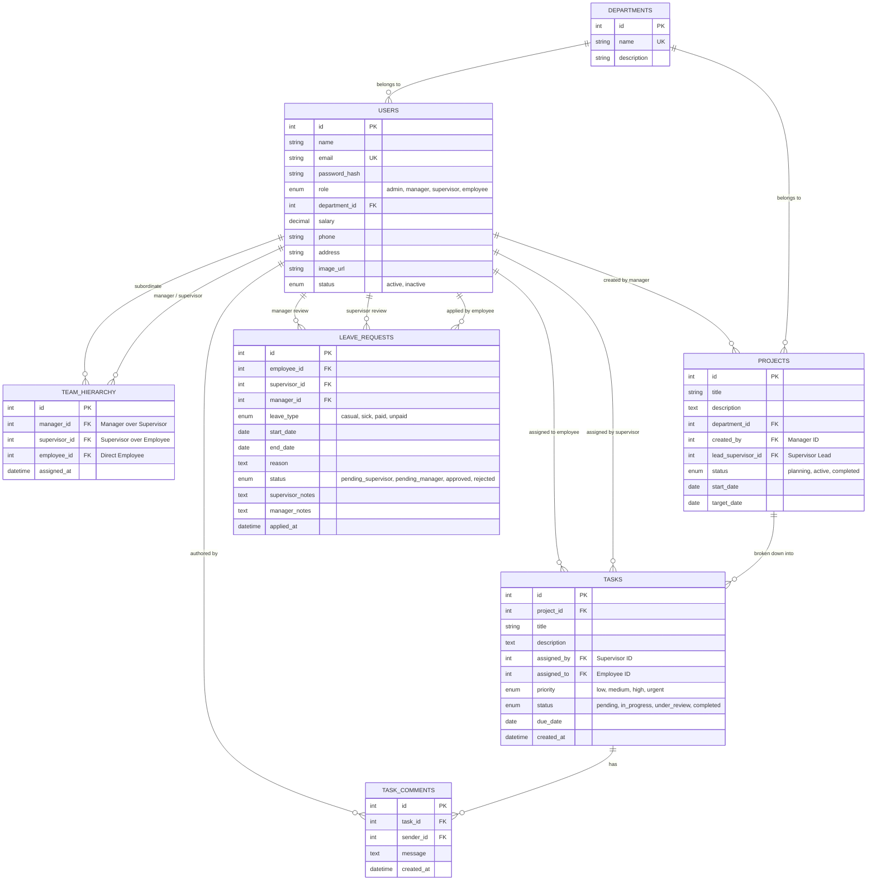
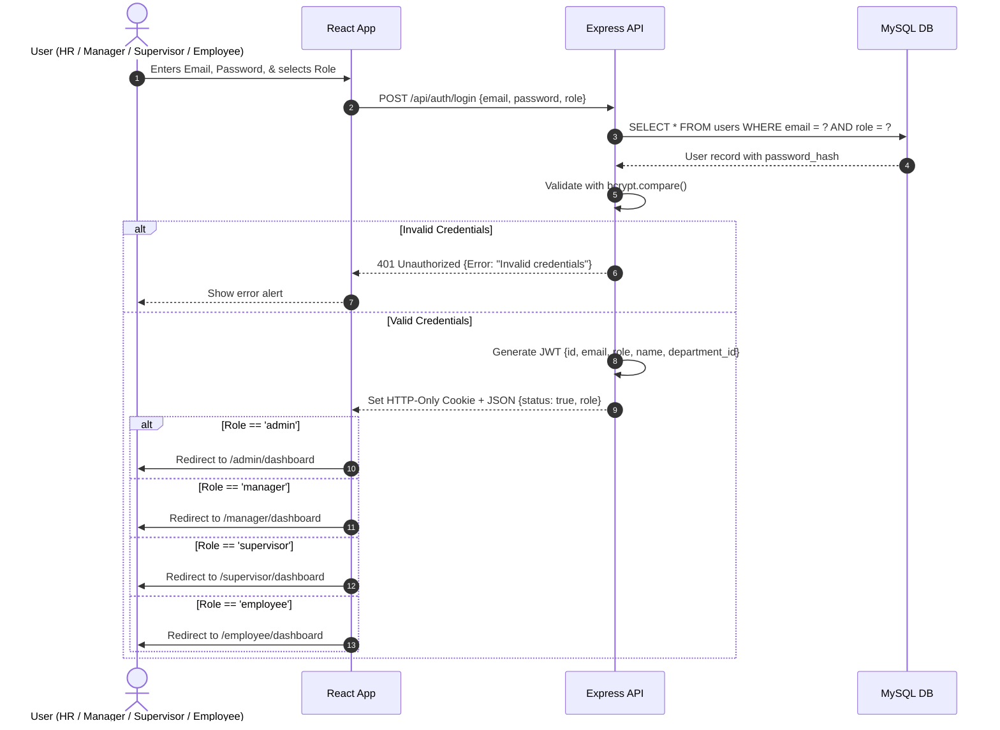
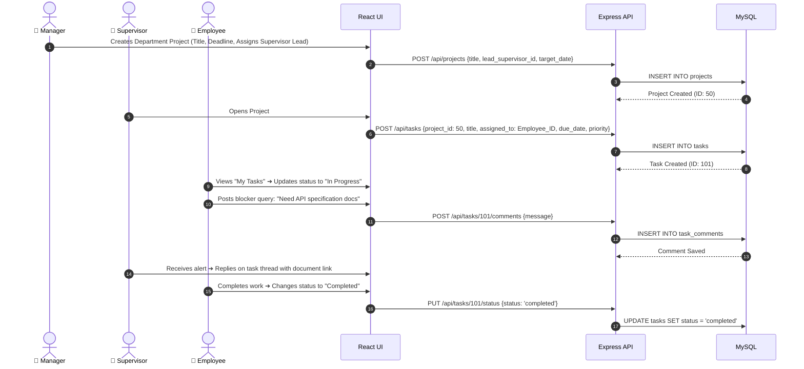
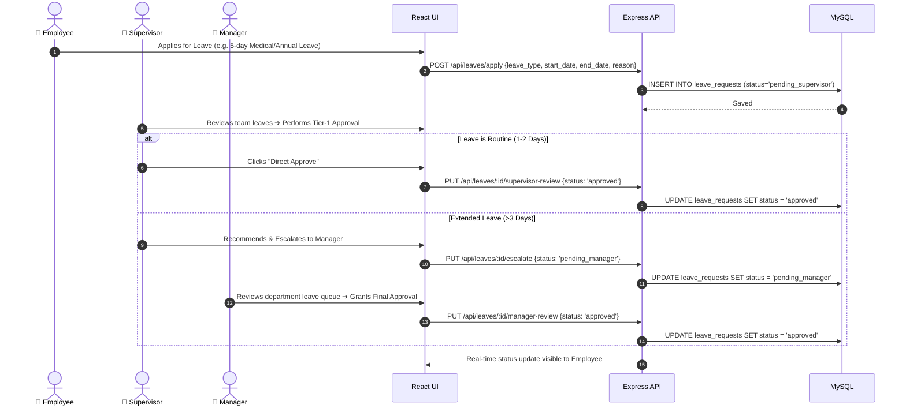

# 🏢 Enterprise Employee Management System (EMS)
## Complete 4-Tier Architecture, Database Schema, Workflows & Implementation Blueprint

---

## 📌 1. Executive Summary & 4-Tier Organizational Hierarchy

The **Enterprise Employee Management System (EMS)** is an enterprise-level role-based platform designed to coordinate corporate governance, strategic planning, team supervision, and individual task execution across **four distinct organizational tiers**:

```
┌─────────────────────────────────────────────────────────────────────────┐
│                        TIER 1: HR / SUPER ADMIN                         │
│   • Single Master Admin with organization-wide governance & control    │
│   • Onboards Managers, Supervisors & Employees; manages Departments    │
│   • Oversees company-wide Payroll, Policy, and Macro Analytics          │
└────────────────────────────────────┬────────────────────────────────────┘
                                     │ Supervises & Onboards
                                     ▼
┌─────────────────────────────────────────────────────────────────────────┐
│                         TIER 2: MANAGERS                                │
│   • Department & Strategic Leads (e.g., Engineering, Marketing, Sales) │
│   • Creates Department Projects, Milestones, and Resource Budgets      │
│   • Assigns Supervisors to Teams & monitors Supervisor productivity    │
│   • Approves escalated / long-term leaves & conducts Appraisals        │
└────────────────────────────────────┬────────────────────────────────────┘
                                     │ Allocates Projects & Supervises
                                     ▼
┌─────────────────────────────────────────────────────────────────────────┐
│                        TIER 3: SUPERVISORS                              │
│   • Operational Team Leads & Scrum Masters                             │
│   • Breaks project milestones into day-to-day tasks with deadlines     │
│   • Assigns tasks directly to subordinates & tracks task status        │
│   • Conducts two-way task feedback & handles Tier-1 leave approvals    │
└────────────────────────────────────┬────────────────────────────────────┘
                                     │ Assigns Tasks & Mentors
                                     ▼
┌─────────────────────────────────────────────────────────────────────────┐
│                         TIER 4: EMPLOYEES                               │
│   • Individual Contributors & Execution Staff                          │
│   • Manages assigned task queue (To-Do ➔ In-Progress ➔ Completed)      │
│   • Communicates blockers via interactive task discussion threads       │
│   • Applies for leaves & tracks real-time multi-level approval status  │
│   • Views personal profile, attendance records, and salary details     │
└─────────────────────────────────────────────────────────────────────────┘
```

---

## ⚡ 2. Distinct Powers Breakdown: Manager vs. Supervisor

| Dimension | 👔 Tier 2: Manager (Strategic Lead) | 👷 Tier 3: Supervisor (Operational Lead) |
| :--- | :--- | :--- |
| **Primary Scope** | **Macro / Departmental**: Manages an entire department (e.g., Engineering) and multiple supervisors. | **Micro / Team-Level**: Manages a specific squad or module of 4–12 direct employees. |
| **Project & Task Powers** | Creates high-level **Projects & Milestones**; assigns project ownership to Supervisors. | Breaks milestones into **granular Tasks/Tickets**; assigns tasks to individual employees with deadlines. |
| **Leave Approval Powers** | **Tier-2 / Escalated Leaves**: Approves extended leaves (>3 days), annual leaves, or supervisor leaves. | **Tier-1 / Routine Leaves**: First-line approval for casual/sick leaves for their direct team. |
| **Performance & Reviews** | Evaluates overall department velocity, supervisor performance, and salary appraisals. | Monitors daily employee output, code/task quality, attendance, and sprint completion. |
| **Team Management** | Assigns Supervisors to specific Project Teams; requests new headcounts to HR. | Re-allocates daily tickets among employees; mentors staff on technical blockers. |

---

## 🔐 3. Complete Role-Based Access Control (RBAC) Matrix

| Feature / Action | 👑 HR / Admin | 👔 Manager | 👷 Supervisor | 💼 Employee |
| :--- | :---: | :---: | :---: | :---: |
| **Login Portal** | Dedicated Super Admin | Email / Password | Email / Password | Email / Password |
| **Manage Departments** | ✅ Full CRUD | 👁️ View Department | 👁️ View Department | 👁️ View Department |
| **Onboard Users** | ✅ (All Roles) | ❌ | ❌ | ❌ |
| **Assign Supervisor to Manager** | ✅ Full Control | ❌ | ❌ | ❌ |
| **Assign Employee to Supervisor** | ✅ Full Control | ✅ (Within Department) | ❌ | ❌ |
| **Create Projects & Milestones** | ✅ Global | ✅ (Department-Level) | ❌ | ❌ |
| **Create & Assign Daily Tasks** | ✅ Global Override | 👁️ Oversee All Tasks | ✅ (To Direct Team) | ❌ |
| **Update Task Execution Status** | ✅ | ✅ | ✅ | ✅ (Assigned tasks only) |
| **Task Discussion & Chat** | ✅ Audit View | 👁️ Read & Comment | ✅ Two-way with Team | ✅ Two-way with Supervisor |
| **Leave Approvals** | ✅ Final Override | ✅ Tier-2 / Escalated | ✅ Tier-1 (Direct Team) | ❌ (Apply Only) |
| **Analytics & Reports** | ✅ Company-wide | ✅ Department-wide | ✅ Team-level | ❌ (Personal only) |

---

## 🗄️ 4. Relational Database Schema & Architecture (MySQL)

### 4.1. Entity-Relationship (ER) Diagram



### 4.2. Complete MySQL DDL Script

```sql
-- Database Initialization
CREATE DATABASE IF NOT EXISTS employeems;
USE employeems;

-- 1. Departments Table
CREATE TABLE IF NOT EXISTS departments (
    id INT AUTO_INCREMENT PRIMARY KEY,
    name VARCHAR(100) NOT NULL UNIQUE,
    description TEXT,
    created_at TIMESTAMP DEFAULT CURRENT_TIMESTAMP
);

-- 2. Unified Users Table (Admins, Managers, Supervisors, Employees)
CREATE TABLE IF NOT EXISTS users (
    id INT AUTO_INCREMENT PRIMARY KEY,
    name VARCHAR(150) NOT NULL,
    email VARCHAR(150) NOT NULL UNIQUE,
    password_hash VARCHAR(255) NOT NULL,
    role ENUM('admin', 'manager', 'supervisor', 'employee') NOT NULL DEFAULT 'employee',
    department_id INT,
    salary DECIMAL(12, 2) DEFAULT 0.00,
    phone VARCHAR(20),
    address VARCHAR(255),
    image_url VARCHAR(255) DEFAULT '',
    status ENUM('active', 'inactive') DEFAULT 'active',
    created_at TIMESTAMP DEFAULT CURRENT_TIMESTAMP,
    FOREIGN KEY (department_id) REFERENCES departments(id) ON DELETE SET NULL
);

-- 3. Organizational Team Hierarchy Mapping
CREATE TABLE IF NOT EXISTS team_hierarchy (
    id INT AUTO_INCREMENT PRIMARY KEY,
    manager_id INT NOT NULL,
    supervisor_id INT NOT NULL,
    employee_id INT NOT NULL UNIQUE, -- Each employee has one supervisor
    assigned_at TIMESTAMP DEFAULT CURRENT_TIMESTAMP,
    FOREIGN KEY (manager_id) REFERENCES users(id) ON DELETE CASCADE,
    FOREIGN KEY (supervisor_id) REFERENCES users(id) ON DELETE CASCADE,
    FOREIGN KEY (employee_id) REFERENCES users(id) ON DELETE CASCADE
);

-- 4. Projects & Milestones Table (Created by Managers)
CREATE TABLE IF NOT EXISTS projects (
    id INT AUTO_INCREMENT PRIMARY KEY,
    title VARCHAR(200) NOT NULL,
    description TEXT,
    department_id INT NOT NULL,
    created_by INT NOT NULL,           -- Manager User ID
    lead_supervisor_id INT NOT NULL,   -- Assigned Supervisor Lead
    status ENUM('planning', 'active', 'completed') DEFAULT 'active',
    start_date DATE NOT NULL,
    target_date DATE NOT NULL,
    created_at TIMESTAMP DEFAULT CURRENT_TIMESTAMP,
    FOREIGN KEY (department_id) REFERENCES departments(id) ON DELETE CASCADE,
    FOREIGN KEY (created_by) REFERENCES users(id) ON DELETE CASCADE,
    FOREIGN KEY (lead_supervisor_id) REFERENCES users(id) ON DELETE CASCADE
);

-- 5. Tasks Table (Created by Supervisors under Projects)
CREATE TABLE IF NOT EXISTS tasks (
    id INT AUTO_INCREMENT PRIMARY KEY,
    project_id INT NULL,
    title VARCHAR(200) NOT NULL,
    description TEXT,
    assigned_by INT NOT NULL,          -- Supervisor User ID
    assigned_to INT NOT NULL,          -- Employee User ID
    priority ENUM('low', 'medium', 'high', 'urgent') DEFAULT 'medium',
    status ENUM('pending', 'in_progress', 'under_review', 'completed') DEFAULT 'pending',
    due_date DATE NOT NULL,
    created_at TIMESTAMP DEFAULT CURRENT_TIMESTAMP,
    updated_at TIMESTAMP DEFAULT CURRENT_TIMESTAMP ON UPDATE CURRENT_TIMESTAMP,
    FOREIGN KEY (project_id) REFERENCES projects(id) ON DELETE SET NULL,
    FOREIGN KEY (assigned_by) REFERENCES users(id) ON DELETE CASCADE,
    FOREIGN KEY (assigned_to) REFERENCES users(id) ON DELETE CASCADE
);

-- 6. Task Comments Table (Two-Way Interactive Discussion)
CREATE TABLE IF NOT EXISTS task_comments (
    id INT AUTO_INCREMENT PRIMARY KEY,
    task_id INT NOT NULL,
    sender_id INT NOT NULL,
    message TEXT NOT NULL,
    created_at TIMESTAMP DEFAULT CURRENT_TIMESTAMP,
    FOREIGN KEY (task_id) REFERENCES tasks(id) ON DELETE CASCADE,
    FOREIGN KEY (sender_id) REFERENCES users(id) ON DELETE CASCADE
);

-- 7. Multi-Tier Leave Requests Table
CREATE TABLE IF NOT EXISTS leave_requests (
    id INT AUTO_INCREMENT PRIMARY KEY,
    employee_id INT NOT NULL,
    supervisor_id INT NOT NULL,
    manager_id INT NULL,
    leave_type ENUM('casual', 'sick', 'paid', 'unpaid') NOT NULL DEFAULT 'casual',
    start_date DATE NOT NULL,
    end_date DATE NOT NULL,
    reason TEXT NOT NULL,
    status ENUM('pending_supervisor', 'pending_manager', 'approved', 'rejected') DEFAULT 'pending_supervisor',
    supervisor_notes TEXT NULL,
    manager_notes TEXT NULL,
    applied_at TIMESTAMP DEFAULT CURRENT_TIMESTAMP,
    reviewed_at TIMESTAMP NULL,
    FOREIGN KEY (employee_id) REFERENCES users(id) ON DELETE CASCADE,
    FOREIGN KEY (supervisor_id) REFERENCES users(id) ON DELETE CASCADE,
    FOREIGN KEY (manager_id) REFERENCES users(id) ON DELETE SET NULL
);
```

---

## 🔄 5. System Sequence Workflows & Interactive Flows

### 5.1. Authentication & Role-Based Portal Routing


---

### 5.2. Strategic Project Milestone ➔ Operational Task Delegation Flow


---

### 5.3. Multi-Level Leave Approval Flow (Supervisor ➔ Manager Escalation)


---

## 🎨 6. Frontend Portal Hierarchy (React 18 + Vite)

```
/
├── /login ──────── Unified Enterprise Login with 4-Role Selector
│
├── /admin (👑 HR Super Admin Portal)
│   ├── /dashboard ──────── Global KPIs (Total Staff, Departments, Payroll, Open Leaves)
│   ├── /departments ────── Full CRUD on Company Departments & Categories
│   ├── /managers ───────── Onboard & Manage Department Managers
│   ├── /supervisors ────── Manage Supervisors & Team Leads
│   ├── /employees ──────── Manage Employees & Staff Directory
│   ├── /hierarchy ──────── Multi-tier Mapping Matrix (Manager ➔ Supervisor ➔ Employee)
│   └── /reports ────────── Company Payroll, Headcount, and Audit Logs
│
├── /manager (👔 Manager Portal)
│   ├── /dashboard ──────── Department Project Velocity, Supervisor Outputs, Budget KPI
│   ├── /projects ───────── Create Projects, Define Milestones, Assign Lead Supervisors
│   ├── /supervisors ────── Track Department Supervisors & Team Performance
│   ├── /leave-queue ────── Tier-2 / Escalated Department Leave Approvals
│   └── /department-tasks ─ Macro overview of all department task completion rates
│
├── /supervisor (👷 Supervisor Portal)
│   ├── /dashboard ──────── Team Sprint Summary, Overdue Tasks, Pending Team Leaves
│   ├── /team ───────────── Direct Subordinate Directory & Contact Cards
│   ├── /tasks ──────────── Task Delegation Modal, Kanban Board (Pending ➔ Done)
│   ├── /task/:id ───────── Task Detail View with Live Two-Way Discussion Drawer
│   └── /leaves ─────────── Tier-1 Leave Approval Queue for Direct Team
│
└── /employee (💼 Employee Portal)
    ├── /dashboard ──────── Personal Tasks Progress, Deadlines, Leave Balances
    ├── /my-tasks ───────── Interactive Task Cards with Status Changer
    ├── /task/:id ───────── View Task Specs & Post Discussion Comments / Blockers
    ├── /leave-apply ────── Leave Request Submission & Real-time Status Tracker
    └── /profile ────────── Personal Profile, Salary Structure, and Attendance Logs
```

---

## 💼 7. Resume & Technical Interview Guide

### Resume Bullet Points (Ready to Copy-Paste)
```markdown
**Full-Stack Enterprise Employee Management System (EMS)** | *React.js, Node.js, Express, MySQL, JWT, Bootstrap*
- Architected a 4-tier enterprise governance platform (HR, Manager, Supervisor, Employee) automating department project milestones, team task delegation, and multi-tier leave approval pipelines.
- Engineered secure JWT-based authentication with HTTP-Only cookies, bcrypt hashing (10 salt rounds), and centralized Role-Based Access Control (RBAC) across 25+ RESTful API endpoints.
- Designed a normalized MySQL relational schema with foreign key constraints, connection pooling (mysql2/promise), and optimized multi-table JOINs for hierarchical workforce mapping.
- Implemented an interactive task collaboration system featuring Kanban workflows, priority flags, deadline notifications, and threaded supervisor-employee discussions.
```

### Top Interview Questions & Strategic Answers

1. **Q: Why did you separate Manager and Supervisor into distinct tiers?**
   > *"In enterprise organizations, Managers focus on strategic planning, department milestones, resource budgeting, and escalated approvals. Supervisors focus on operational execution, granular task tickets, daily mentoring, and Tier-1 leave reviews. Separating them creates a scalable, realistic enterprise architecture."*

2. **Q: How does the system enforce multi-level leave approvals?**
   > *"The `leave_requests` table uses an enum status (`pending_supervisor`, `pending_manager`, `approved`, `rejected`). Routine short leaves are approved directly by the assigned supervisor. Extended leaves (>3 days) are flagged and escalated to the department manager for final sign-off before the record is marked approved."*

3. **Q: How are hierarchical relations managed in your MySQL database?**
   > *"Through a normalized relational mapping table `team_hierarchy(manager_id, supervisor_id, employee_id)` with foreign key cascades. When a user queries their dashboard, SQL inner joins dynamically filter records strictly within their authorized departmental and team scope."*

---
*Enterprise Employee Management System Blueprint — 4-Tier Architecture.*
