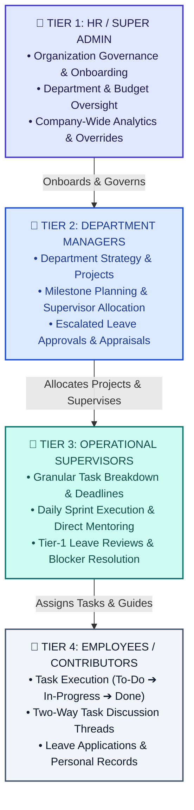
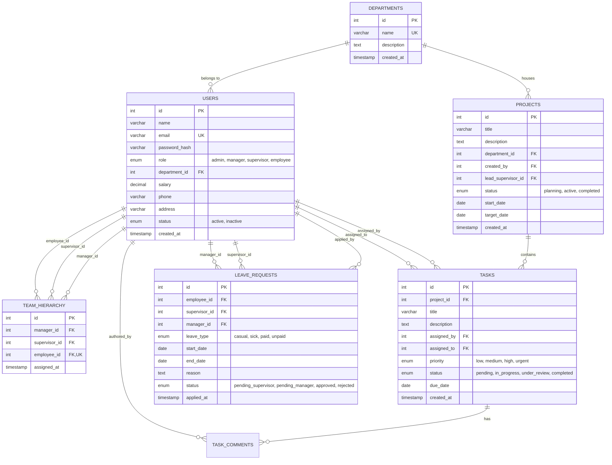

# 🏢 Enterprise Employee Management System (EMS)

[](https://react.dev/)
[](https://www.typescriptlang.org/)
[](https://vitejs.dev/)
[](https://nodejs.org/)
[](https://expressjs.com/)
[](https://www.mysql.com/)
[](https://threejs.org/)
[](https://getbootstrap.com/)
[](LICENSE)

An enterprise-grade, full-stack **Employee & Resource Management System (EMS)** engineered with a strict **4-Tier Organizational Governance Hierarchy**, robust **Role-Based Access Control (RBAC)**, relational data integrity, and an interactive **3D spatial experience** featuring real-time kinematics, volumetric lighting, and organic liquid-geometry portal transitions.

---

## 📑 Table of Contents

- [Architectural Overview](#-architectural-overview)
- [4-Tier Organizational Governance](#-4-tier-organizational-governance)
- [Key Features by Role](#-key-features-by-role)
- [Interactive 3D & Spatial Design](#-interactive-3d--spatial-design)
- [Technology Stack](#-technology-stack)
- [System Architecture & Database Schema](#-system-architecture--database-schema)
- [Project Directory Structure](#-project-directory-structure)
- [Getting Started & Installation](#-getting-started--installation)
  - [Prerequisites](#prerequisites)
  - [Backend Setup](#1-backend-setup)
  - [Frontend Setup](#2-frontend-setup)
- [Environment Configuration](#-environment-configuration)
- [API Reference](#-api-reference)
- [Security & Authentication](#-security--authentication)
- [Contributing](#-contributing)
- [License](#-license)

---

## 🏛️ Architectural Overview

Modern enterprises require distinct segregation between **strategic governance**, **operational planning**, **team leadership**, and **individual execution**. 

This system moves beyond traditional flat employee databases by implementing:
- **Hierarchical Delegation**: Strategic initiatives originate at the executive level, break down into departmental milestones, translate into operational sprint tasks, and resolve through individual ticket execution.
- **Multi-Level Approval Chains**: Leave requests route dynamically through two-step approval stages (operational review by Supervisor, followed by strategic review by Manager/Admin).
- **Relational Integrity**: Foreign key constraints, cascade lifecycles, and relational mapping tables strictly enforce team cohesion and reporting structures.
- **High-Performance Spatial Frontend**: Built on React 19, TypeScript, and Three.js with hardware-accelerated rendering and GPU-driven SVG liquid portal reveals.

---

## 👥 4-Tier Organizational Governance

The platform establishes four distinct tiers of authority, each equipped with dedicated dashboards, custom telemetry, and strict authorization boundaries:



### Strategic Lead (Manager) vs. Operational Lead (Supervisor)

| Responsibility Dimension | 👔 Tier 2: Manager (Strategic Lead) | 👷 Tier 3: Supervisor (Operational Lead) |
| :--- | :--- | :--- |
| **Operational Scope** | **Macro / Departmental**: Manages an entire department (Engineering, Sales, Design) and multiple supervisors. | **Micro / Squad-Level**: Direct lead for a focused team of 4–12 individual contributors. |
| **Project & Task Powers** | Creates high-level **Projects & Milestones**; assigns project ownership to Supervisors. | Breaks project milestones into **granular daily tasks** with deadlines and priorities. |
| **Leave Approval Powers** | **Tier-2 / Escalated Leaves**: Reviews extended leaves (>3 days), annual leaves, and supervisor leaves. | **Tier-1 / Routine Leaves**: First-line approval for casual and medical leaves for their direct squad. |
| **Team Oversight** | Maps Supervisors to Projects; requests headcount modifications to HR. | Re-allocates daily tickets among team members; handles day-to-day technical blockers. |

---

## ✨ Key Features by Role

### 👑 1. HR / Super Admin (Tier 1)
- **Executive Governance Dashboard**: Real-time KPI summaries covering headcount, payroll expenditure, active departments, and cross-organization task velocity.
- **Employee & Role Lifecycle Management**: Onboard, edit, and deactivate accounts across all four roles with encrypted credential provisioning.
- **Department Administration**: Dynamic creation, modification, and budgeting of corporate departments.
- **Hierarchy Mapping Matrix**: Intuitive visual mapping to link employees to supervisors and supervisors to managers.
- **Global Audit & System Overrides**: Master administrative controls to reassign orphaned tasks or expedite approvals.

### 👔 2. Department Manager (Tier 2)
- **Department Command Center**: Departmental productivity metrics, active project count, and supervisor bandwidth.
- **Project & Milestone Engine**: Create high-level departmental initiatives, define completion target dates, and assign lead supervisors.
- **Supervisor Squad Oversight**: Monitor squad health, supervisor task distributions, and member performance.
- **Escalated Leave Management**: Review and authorize long-duration leaves escalated from Tier 1.

### 👷 3. Operational Supervisor (Tier 3)
- **Sprint Management Dashboard**: Live breakdown of tasks in progress, completed tickets, and pending submissions.
- **Task Delegation Studio**: Create and assign actionable tasks to direct team members with explicit priority tags (`low`, `medium`, `high`, `urgent`) and due dates.
- **Interactive Blocker Chat**: Two-way contextual message threads attached directly to individual task cards.
- **Routine Leave Approval**: Instant first-stage review for subordinate leave applications.

### 💼 4. Employee / Contributor (Tier 4)
- **Personal Workspace Dashboard**: Overview of assigned deliverables, approaching deadlines, and leave balance.
- **Task Queue & Status Lifecycle**: Interactive status toggling (`pending` ➔ `in_progress` ➔ `under_review` ➔ `completed`).
- **Contextual Discussion**: Communicate directly with the assigning supervisor on specific tasks with timestamped notes.
- **Self-Service Leave Portal**: Submit formal leave requests and track real-time approval stages.
- **Personal Profile**: Secure view of assigned department, supervisor contact, and verified profile data.

---

## 🎨 Interactive 3D & Spatial Design

The application incorporates modern spatial computing concepts directly into the web interface:

- **Interactive 3D Companion Bot**: Powered by Three.js and `@react-three/fiber`, featuring real-time head and eye kinematics that track cursor trajectory, organic breathing oscillation, typing anticipation, and interactive password-hide states.
- **Dynamic Volumetric Atmosphere**: Ambient lighting meshes and role-reactive color themes that adapt depending on the active user role.
- **Liquid-Geometry Portal Transitions**: Button-originated SVG radial expansion and contraction overlays with continuous micro-geometry fallbacks, delivering seamless page transitions with zero layout shift or flash.

---

## 🛠️ Technology Stack

### Frontend Architecture
- **Core Library**: React 19 (TypeScript)
- **Build Tool**: Vite 6 (Hot Module Replacement)
- **Routing**: React Router DOM v7 (Nested Route Overlays, Layout Outlets, Protected Route Guards)
- **3D Graphics & Animation**: Three.js, `@react-three/fiber`, `@react-three/drei`, Framer Motion
- **UI Framework & Styling**: Bootstrap 5.3, Bootstrap Icons, Custom Glassmorphism CSS Modules
- **HTTP Client**: Axios (with credentials and interceptors)

### Backend Architecture
- **Runtime Environment**: Node.js (v18+)
- **Application Framework**: Express 5 (ES Modules)
- **Database Engine**: MySQL 8 (via `mysql2` connection pooling)
- **Authentication**: JSON Web Tokens (`jsonwebtoken`), HTTP-only Cookies (`cookie-parser`)
- **Password Security**: Salted hashing with `bcrypt`
- **File Management**: `multer` for secure disk storage of user assets
- **Security Middleware**: Configured `cors` with origin whitelisting, parameterized SQL queries

---

## 🗄️ System Architecture & Database Schema

The database schema is engineered for relational consistency, referential integrity, and efficient querying across corporate tiers:



---

## 📁 Project Directory Structure

```plaintext
Employee-Management-System/
├── Employee-MS/                  # Frontend Client (React 19 + TypeScript + Vite)
│   ├── public/                   # Static assets and public resources
│   ├── src/
│   │   ├── api/                  # Axios HTTP client instances and API endpoints
│   │   ├── assets/               # Brand logos, 3D textures, and static media
│   │   ├── Components/
│   │   │   ├── auth/             # 3D Character Companion, Kinematics & Atmosphere
│   │   │   │   ├── CharacterStage.tsx
│   │   │   │   ├── useCharacterKinematics.ts
│   │   │   │   └── VolumetricAtmosphere.tsx
│   │   │   └── common/           # Shared UI elements, modals & transition containers
│   │   │       ├── Layout.tsx
│   │   │       ├── ProtectedRoute.tsx
│   │   │       ├── RadialRevealTransition.tsx
│   │   │       ├── Sidebar.tsx
│   │   │       └── TaskDiscussionModal.tsx
│   │   ├── context/              # Authentication and global state providers
│   │   ├── pages/
│   │   │   ├── admin/            # Super Admin views (Dashboard, Departments, Hierarchy, Users)
│   │   │   ├── manager/          # Manager views (Dashboard, Projects, Supervisors, Leaves)
│   │   │   ├── supervisor/       # Supervisor views (Dashboard, Tasks, Team, Leaves)
│   │   │   ├── employee/         # Employee views (Dashboard, Tasks, Profile, Leaves)
│   │   │   ├── LandingPage.tsx   # Modern interactive product landing page
│   │   │   └── Login.tsx         # Unified authentication hub with 3D companion
│   │   ├── App.tsx               # Root route router configuration & overlay portals
│   │   └── main.tsx              # Application entrypoint
│   ├── package.json
│   ├── tsconfig.json
│   └── vite.config.ts
│
├── Server/                       # Backend REST API Service (Node.js + Express + MySQL)
│   ├── config/                   # MySQL connection pool configuration
│   ├── controllers/              # Business logic controllers per role and domain
│   ├── middleware/               # JWT authentication and RBAC authorization guards
│   ├── routes/                   # Modular route declarations (/auth, /admin, /manager, etc.)
│   ├── utils/                    # Password hashing utilities and initial database seeders
│   ├── schema.sql                # Complete MySQL DDL definitions & table structures
│   ├── index.js                  # Express application bootstrap and server entry
│   ├── .env.example              # Sanitized environment template
│   └── package.json
│
├── PROJECT_ARCHITECTURE_AND_ROADMAP.md # Detailed system specifications and engineering blueprint
└── README.md                     # Repository documentation
```

---

## 🚀 Getting Started & Installation

### Prerequisites
Make sure your environment meets the following requirements:
- **Node.js**: v18.0.0 or later ([Download](https://nodejs.org/))
- **npm**: v9.0.0 or later (bundled with Node.js)
- **MySQL Server**: v8.0 or later ([Download](https://dev.mysql.com/downloads/mysql/))
- **Git**: Installed and configured ([Download](https://git-scm.com/))

---

### 1. Backend Setup

1. **Navigate to the Server Directory**:
   ```bash
   cd Server
   ```

2. **Install Dependencies**:
   ```bash
   npm install
   ```

3. **Configure Environment Variables**:
   Create a `.env` file in the `Server` directory using the provided template:
   ```bash
   cp .env.example .env
   ```
   Edit the `.env` file with your local database credentials:
   ```ini
   PORT=3000
   DB_HOST=localhost
   DB_PORT=3306
   DB_USER=root
   DB_PASSWORD=your_local_mysql_password
   DB_NAME=employeems
   JWT_SECRET=your_secure_random_jwt_secret_key
   CLIENT_URL=http://localhost:5173
   ```

4. **Initialize the Database**:
   Create the database and required tables using the provided SQL schema:
   ```bash
   mysql -u root -p < schema.sql
   ```

5. **Start the Backend Server**:
   ```bash
   # Development mode with hot-reloading
   npm run dev

   # Or standard production start
   npm start
   ```
   *The server will verify connection pools, run initial seeders, and start on `http://localhost:3000`.*

---

### 2. Frontend Setup

1. **Navigate to the Frontend Directory**:
   ```bash
   cd ../Employee-MS
   ```

2. **Install Dependencies**:
   ```bash
   npm install
   ```

3. **Configure Client Environment (Optional)**:
   If configuring custom backend endpoints, verify your API base URL in `src/api/apiClient.ts` or create `.env`:
   ```ini
   VITE_API_BASE_URL=http://localhost:3000
   ```

4. **Start the Development Server**:
   ```bash
   npm run dev
   ```
   *Vite will compile and launch the application at `http://localhost:5173`.*

5. **Verify TypeScript Compilation**:
   ```bash
   npm run build
   ```

---

## ⚙️ Environment Configuration

### Backend (`Server/.env`)
| Variable | Description | Example / Default |
| :--- | :--- | :--- |
| `PORT` | Port on which Express listens | `3000` |
| `DB_HOST` | Hostname of the MySQL server | `localhost` |
| `DB_PORT` | Port of the MySQL service | `3306` |
| `DB_USER` | MySQL database user | `root` |
| `DB_PASSWORD` | Password for the MySQL user | `your_mysql_password` |
| `DB_NAME` | Relational database schema name | `employeems` |
| `JWT_SECRET` | Secret key for signing and verifying tokens | `your_strong_secret` |
| `CLIENT_URL` | Frontend origin allowed for CORS cookies | `http://localhost:5173` |

---

## 🔌 API Reference

### Authentication (`/api/auth`)
| Method | Endpoint | Access Level | Description |
| :--- | :--- | :--- | :--- |
| `POST` | `/api/auth/login` | Public | Authenticates user credentials and issues secure JWT |
| `POST` | `/api/auth/register` | Public | Account registration endpoint |
| `POST` | `/api/auth/logout` | Authenticated | Clears session cookie and invalidates client token |
| `GET` | `/api/auth/me` | Authenticated | Fetches authenticated session profile and role data |

### Super Admin (`/api/admin`)
| Method | Endpoint | Access Level | Description |
| :--- | :--- | :--- | :--- |
| `GET` | `/api/admin/stats` | Admin | Fetches organization-wide KPIs and telemetry |
| `GET` | `/api/admin/departments` | Admin | Lists all company departments |
| `POST` | `/api/admin/departments` | Admin | Creates a new corporate department |
| `DELETE` | `/api/admin/departments/:id` | Admin | Deletes an existing department |
| `GET` | `/api/admin/users` | Admin | Retrieves all active users across tiers |
| `POST` | `/api/admin/users` | Admin | Onboards a new user with role assignment |
| `DELETE` | `/api/admin/users/:id` | Admin | Removes or deactivates a user account |
| `GET` | `/api/admin/hierarchy` | Admin | Retrieves the current reporting hierarchy |
| `POST` | `/api/admin/hierarchy` | Admin | Maps employee to supervisor and supervisor to manager |

### Department Manager (`/api/manager`)
| Method | Endpoint | Access Level | Description |
| :--- | :--- | :--- | :--- |
| `GET` | `/api/manager/dashboard` | Manager, Admin | Department-specific performance summaries |
| `GET` | `/api/manager/projects` | Manager, Admin | Retrieves department project milestones |
| `POST` | `/api/manager/projects` | Manager, Admin | Creates a project milestone and assigns lead supervisor |
| `GET` | `/api/manager/supervisors` | Manager, Admin | Lists supervisors assigned to the department |
| `GET` | `/api/manager/leaves` | Manager, Admin | Retrieves escalated leave requests |
| `PUT` | `/api/manager/leaves/:id/review` | Manager, Admin | Approves or rejects escalated leave |

### Operational Supervisor (`/api/supervisor`)
| Method | Endpoint | Access Level | Description |
| :--- | :--- | :--- | :--- |
| `GET` | `/api/supervisor/dashboard` | Supervisor, Manager, Admin | Squad performance overview and task counts |
| `GET` | `/api/supervisor/team` | Supervisor, Manager, Admin | Lists direct subordinate employees |
| `GET` | `/api/supervisor/tasks` | Supervisor, Manager, Admin | Retrieves all tasks assigned to the squad |
| `POST` | `/api/supervisor/tasks` | Supervisor, Manager, Admin | Creates and delegates a new task to an employee |
| `GET` | `/api/supervisor/leaves` | Supervisor, Manager, Admin | Lists routine leave requests from team members |
| `PUT` | `/api/supervisor/leaves/:id/review` | Supervisor, Manager, Admin | Approves, rejects, or escalates routine leave |

### Employee (`/api/employee`)
| Method | Endpoint | Access Level | Description |
| :--- | :--- | :--- | :--- |
| `GET` | `/api/employee/dashboard` | Authenticated Employee | Personal task progress and leave quotas |
| `GET` | `/api/employee/tasks` | Authenticated Employee | Retrieves personal task queue |
| `PUT` | `/api/employee/tasks/:id/status` | Authenticated Employee | Updates status (`pending`, `in_progress`, etc.) |
| `GET` | `/api/employee/leaves` | Authenticated Employee | Lists historical and active personal leave requests |
| `POST` | `/api/employee/leaves` | Authenticated Employee | Submits a new leave application |
| `GET` | `/api/employee/profile` | Authenticated Employee | Retrieves personal employee details |

### Task Collaboration (`/api/tasks`)
| Method | Endpoint | Access Level | Description |
| :--- | :--- | :--- | :--- |
| `GET` | `/api/tasks/:id` | Authenticated | Fetches details and metadata for a specific task |
| `GET` | `/api/tasks/:id/comments` | Authenticated | Retrieves discussion comments on a task |
| `POST` | `/api/tasks/:id/comments` | Authenticated | Adds a comment or blocker note to a task thread |

---

## 🔒 Security & Authentication

- **Role-Based Route Guards**: The frontend leverages high-order `<ProtectedRoute allowedRoles={[...]} />` components to block unauthorized URL navigation and route access.
- **Stateless JWT Authentication**: Tokens contain user IDs and roles, verified on every API request via `verifyToken` middleware.
- **SQL Injection Prevention**: All queries to the MySQL database use parameterized prepared statements via `mysql2`.
- **Password Protection**: Passwords are never stored in plaintext; they are hashed using `bcrypt` with adaptive salt rounds.
- **CORS Protection**: Origin-specific whitelisting ensures credentials and cookies cannot be intercepted across untrusted domains.

---

## 🤝 Contributing

Contributions, feedback, and issue reports are welcome! To contribute:

1. **Fork the Repository**
2. **Create a Feature Branch**:
   ```bash
   git checkout -b feature/YourFeatureName
   ```
3. **Commit Your Changes**:
   ```bash
   git commit -m "feat: add your awesome feature"
   ```
4. **Push to the Branch**:
   ```bash
   git push origin feature/YourFeatureName
   ```
5. **Open a Pull Request** with a description of the changes.

---

## 📄 License

This project is licensed under the **MIT License**. See the [LICENSE](LICENSE) file for more information.

